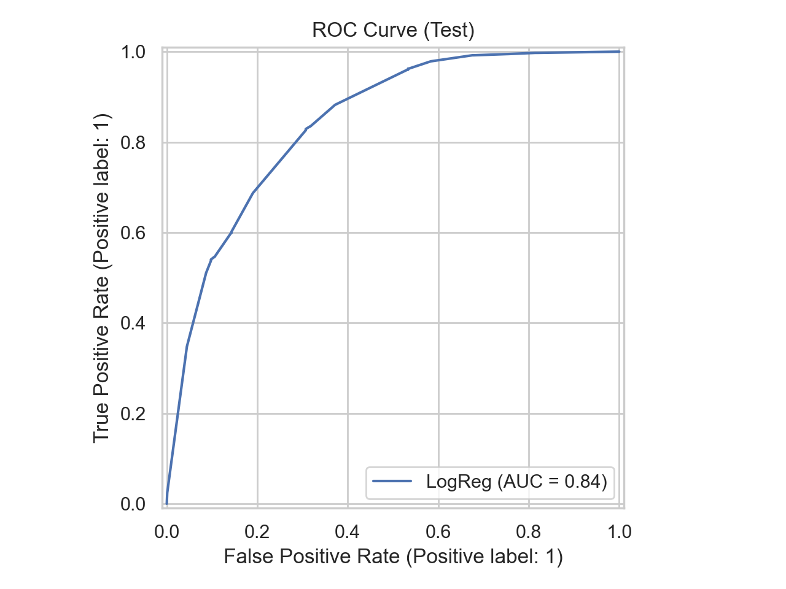
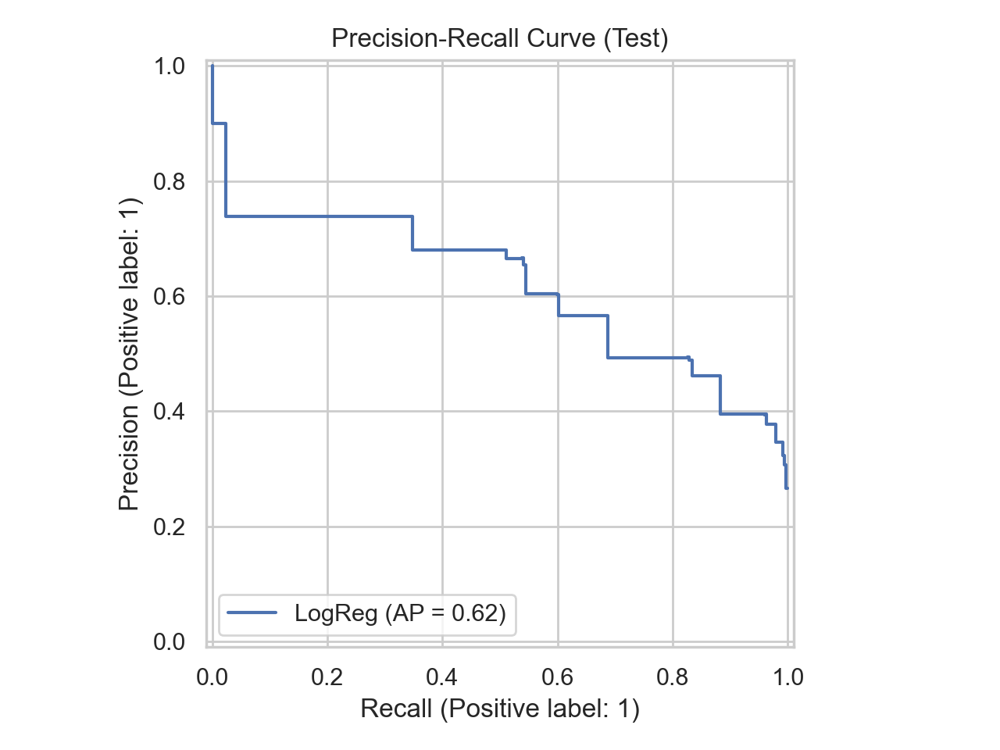
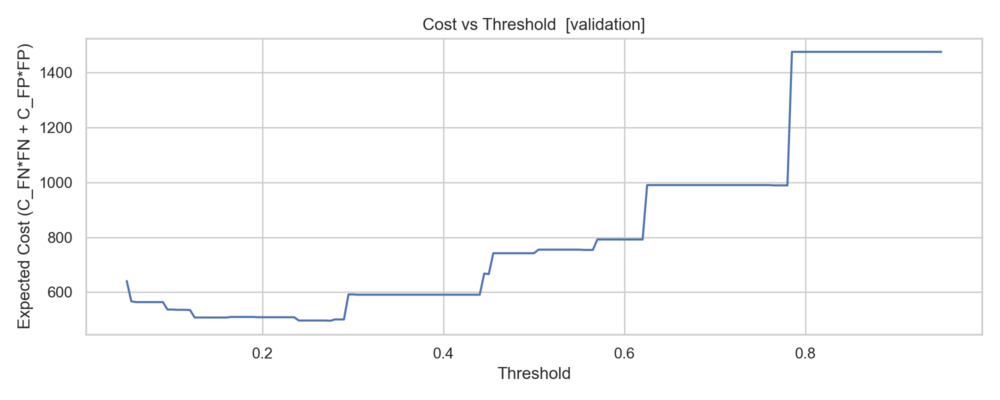
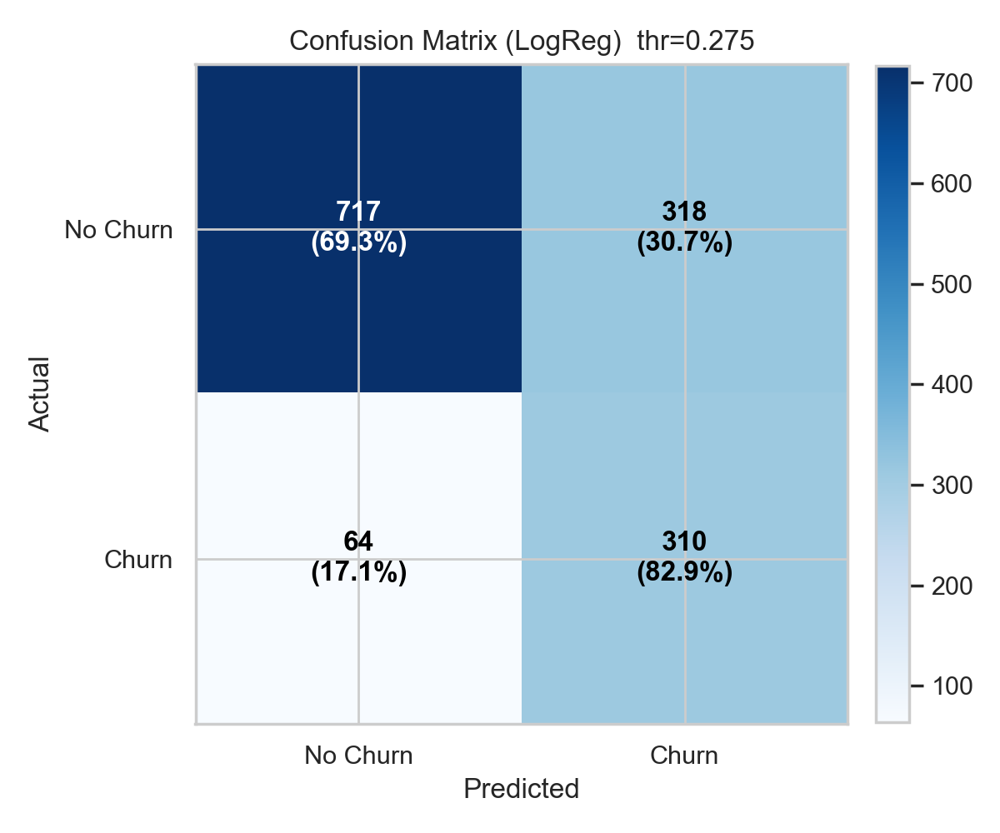
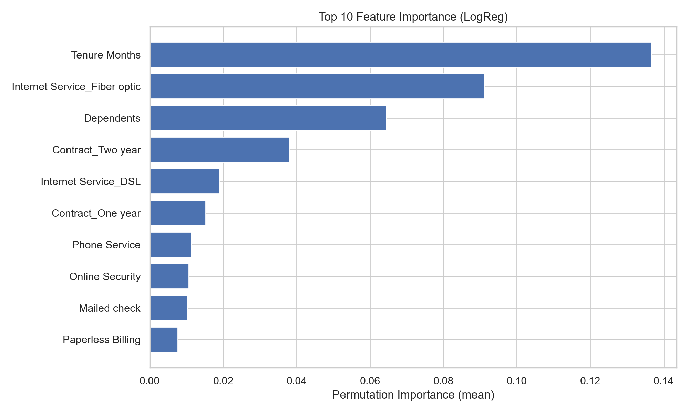
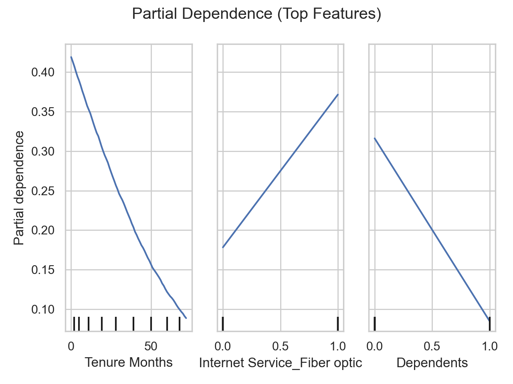

# Cost-Sensitive Customer Churn Prediction for a Telecom Provider

This project develops an end-to-end, interpretable machine learning pipeline to predict customer churn for a telecommunications provider.  
Rather than optimizing raw classification accuracy, the emphasis is on **cost-sensitive decision-making**, combining probability calibration, class imbalance handling, and business-aware threshold optimization.

---

## Problem Overview

Customer churn is a major source of revenue loss in subscription-based businesses.  
The objective is to estimate **each customer’s probability of churn** and use these probabilities to support **data-driven retention strategies**.

Instead of relying on a fixed 0.5 classification cutoff, the model selects an operating threshold that **minimizes expected business cost**, explicitly balancing:
- missed churners (lost revenue), and
- unnecessary retention outreach (intervention cost).

---
## Data

- **Source:** IBM Telco Customer Churn dataset (Kaggle)  
  https://www.kaggle.com/datasets/yeanzc/telco-customer-churn-ibm-dataset
- **Observations:** ~7,000 customers
- **Target:** Binary churn indicator (Yes / No)

### Class imbalance
- No churn ≈ 5,174
- Churn ≈ 1,869

The strong class imbalance motivates the use of **SMOTE** during model training to improve recall on churners while avoiding information leakage.

---

## Key Features

- End-to-end ML workflow: EDA → feature engineering → modeling → evaluation
- Class imbalance handled using **SMOTE** (training data only)
- **Calibrated churn probabilities** using isotonic regression
- Business-cost–aware threshold optimization
- Strong emphasis on **interpretability and explainability**

---

## Exploratory Data Analysis (EDA)

EDA was used to understand churn drivers before modeling. Key findings include:

- **Contract type strongly influences churn**  
  Month-to-month customers churn far more than those on long-term contracts.

- **Internet service matters**  
  Fiber optic customers exhibit substantially higher churn rates than DSL or no-internet users.

- **Payment method friction**  
  Customers paying via electronic check churn at much higher rates than those using automatic payments.

- **Tenure effect**  
  Churn risk decreases sharply as customer tenure increases.

These insights guided feature engineering, model choice, and downstream interpretability analysis.

---

## Repository Structure

```text
telecom-churn-prediction/
├── data/        # Raw and processed datasets
├── notebooks/   # Exploratory analysis and experiments
├── src/         # Reusable modeling and evaluation code
├── figures/     # Generated plots and diagnostics
├── models/      # Trained models and calibration artifacts
└── README.md
```

## How to Run

### 1) Clone or download this repository
```bash
git clone https://github.com/<YOUR-USERNAME>/telecom-churn-prediction.git
cd telecom-churn-prediction
```
### 2) Install the necessary dependencies
   ```bash
pip install -r requirements.txt
```
### 3) Install the necessary dependencies
Place the dataset file Telco_customer_churn.xlsx inside the data/ folder

### 4) Run the full pipeline
```bash
python telecom_churn_modeling.py
```

---

## Feature Engineering & Multicollinearity Control

- Categorical variables were encoded using **one-hot encoding**
- Numerical features were cleaned and median-imputed
- To improve model stability and interpretability:
  - Pairwise correlations were inspected
  - **Variance Inflation Factor (VIF)** was computed on the encoded feature matrix
  - Highly collinear predictors (VIF > 10) were iteratively removed

This ensured:
- More stable logistic regression coefficients
- Reduced redundancy among correlated service indicators
- A consistent feature set used across all downstream modeling

---

## Modeling Approach (Interpretable + Cost-Sensitive)

We evaluated multiple classification models (e.g., linear and tree-based - LogReg, HistGB, Random Forest) during experimentation.  
The final pipeline uses **Logistic Regression** as the primary model because it provides **well-behaved probabilities** and strong **interpretability**, which aligns with the project goal: **cost-sensitive decision-making** (not just accuracy).

**Pipeline highlights**
- **Imbalance handling:** SMOTE applied **only to training folds** (prevents leakage)
- **Probability calibration:** Isotonic regression on a calibration split
- **Decision rule:** Business-aware **threshold optimization** to minimize expected cost (vs. default 0.5 cutoff)
- **Explainability:** Permutation importance + partial dependence to interpret drivers of churn risk

---

## Evaluation Framework (Decision-Focused)

Rather than relying solely on accuracy, the model is evaluated using:

- **ROC-AUC** (overall ranking performance)
- **PR-AUC / Average Precision** (imbalance-aware)
- **Confusion matrices at multiple thresholds**
- **Expected business cost**

### Cost Function

Expected Cost = C_FN · FN + C_FP · FP

Where:
- **C_FN:** cost of missing a churner (lost lifetime value)
- **C_FP:** cost of unnecessary retention outreach

The decision threshold is chosen to **minimize expected cost**, not maximize accuracy.

---

## Key Results

- **ROC-AUC:** ~0.84
- **PR-AUC:** ~0.62 (strong given class imbalance)
- **Optimal threshold:** ~0.27 (cost-minimizing)
- **Recall improvement:** substantially fewer missed churners compared to a 0.5 cutoff
- **Trade-off:** higher false positives, but lower overall business cost

This demonstrates why **threshold selection matters as much as model choice**.

### Discrimination performance
ROC and Precision–Recall curves summarize ranking performance on the test set.





### Cost-sensitive thresholding (decision-focused)
Instead of a fixed 0.5 threshold, we select an operating point that minimizes expected cost by balancing:
- **False negatives** (missed churners → lost revenue)
- **False positives** (unnecessary retention offers → intervention cost)





### Interpretability (what drives churn risk)
Top drivers are consistent with telecom churn behavior: tenure, contract type, and internet service features.





---

## Interpretability & Business Implications

### Top Drivers of Churn

- **Tenure Months:** strong protective effect with increasing tenure
- **Fiber Optic Service:** higher churn risk than DSL or no internet
- **Dependents:** customers with dependents are less likely to churn
- **Contract Length:** longer contracts reduce churn risk

These effects are consistent across:
- Exploratory data analysis
- Permutation feature importance
- Partial dependence plots

### Business Actions

- Retention efforts should prioritize:
  - Low-tenure customers
  - Month-to-month contracts
  - Fiber optic users paying via electronic check

- Cost-based thresholding allows:
  - Aggressive recall when churn costs are high
  - Conservative outreach when intervention costs increase

- The model outputs **calibrated probabilities**, enabling flexible policy decisions rather than hard labels.
